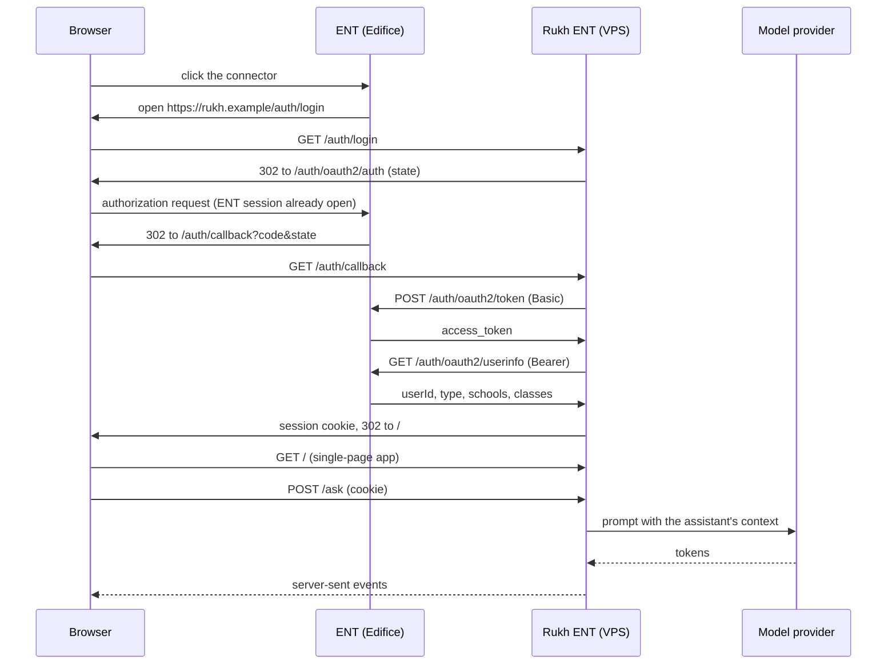

# Rukh ENT: technical specification

## Summary

Rukh ENT is a fork of [Rukh](https://github.com/w3hc/rukh) that a French secondary school adds to its [ENT](https://fr.wikipedia.org/wiki/Espace_num%C3%A9rique_de_travail) (*espace numérique de travail*) as a connector.

- Teachers create and edit course assistants: instructions, documents, links, model.
- Other users (staff, students, parents) chat with the assistants published to their school or class.
- Nobody creates an account. Identity and role come from the ENT, and from nowhere else.

The first target is [ENT Hauts-de-France](https://enthdf.fr/), which runs on the [Edifice](https://edifice.io/) platform.

| Decision | Choice |
| --- | --- |
| Shape | One fork of Rukh, one process, one domain |
| Authentication | Edifice [OAuth 2.0](https://datatracker.ietf.org/doc/html/rfc6749) only. [SIWE](https://eips.ethereum.org/EIPS/eip-4361) and wallets are removed |
| Backend | [NestJS](https://nestjs.com/) and [TypeScript](https://www.typescriptlang.org/), as in Rukh |
| Frontend | [Vite](https://vite.dev/), [React](https://react.dev/), [React Router](https://reactrouter.com/), [Chakra UI](https://chakra-ui.com/) |
| Routes | `/` serves the interface, `/api` serves [Swagger UI](https://swagger.io/tools/swagger-ui/) |
| Hosting | One [OVHcloud VPS](https://www.ovhcloud.com/en/vps/) |
| Optional | An [MCP](https://modelcontextprotocol.io/) endpoint at `/mcp` |

## Status of the evidence

This document is based on reading documentation and source code. Nothing has been run against enthdf.fr.

| Claim type | Basis |
| --- | --- |
| Edifice behavior | [Edifice technical documentation](https://edifice-community.atlassian.net/wiki/spaces/PUBLIC/pages/1184923821/Documentation+technique) and the `master` branch of [entcore](https://github.com/edificeio/entcore). The version deployed on enthdf.fr may differ |
| Rukh behavior | The `main` branch of Rukh, version 0.2.0, and of [rukh-ui](https://github.com/w3hc/rukh-ui) |
| Code in this document | Illustrative. Only two snippets were executed: the session token and the document conversion. Each says so |

Everything that still needs a live test is listed under [To verify on a test platform](#to-verify-on-a-test-platform).

## What changes from upstream Rukh

| Area | Upstream Rukh | Rukh ENT |
| --- | --- | --- |
| Access to `POST /ask` | Public | ENT session required, visibility checked |
| Access to `GET /context` | Public, lists every context | ENT session required, filtered by school and class |
| Context ownership | `creatorAddress`, proven by a SIWE signature ([guard](https://github.com/w3hc/rukh/blob/main/src/guards/siwe-auth.guard.ts)) | `ownerId`, the ENT user id from the session |
| Dependencies | [w3pk](https://www.npmjs.com/package/w3pk), [ethers](https://docs.ethers.org/v6/) | Removed where nothing else uses them |
| `sessionId` on `/ask` | Any client-supplied value is accepted ([source](https://github.com/w3hc/rukh/blob/main/src/ask/ask-preparation.service.ts)) | Owned by the server, bound to the user and the assistant |
| Rate limit on `/ask` | 50 per hour per IP, hardcoded ([source](https://github.com/w3hc/rukh/blob/main/src/config/rate-limit.config.ts)) | Per user, configurable |
| [CORS](https://developer.mozilla.org/en-US/docs/Web/HTTP/CORS) | Any origin, credentials allowed ([source](https://github.com/w3hc/rukh/blob/main/src/main.ts)) | Disabled: the interface is same-origin |
| `GET /` | Redirects to `/api` | Serves the interface |
| Context settings | Model fixed at creation | Editable: model, visibility, description |
| Context files | `.md` only, 5 MB | Same storage, plus conversion from PDF and office formats |
| Interface | Separate [Next.js](https://nextjs.org/) app | Vite app built into the fork and served by it |

Unchanged: the provider layer, the two-step [RAG](https://en.wikipedia.org/wiki/Retrieval-augmented_generation) selection, [streaming](https://github.com/w3hc/rukh/blob/main/docs/STREAMING.md), the [context file layout](https://github.com/w3hc/rukh/blob/main/docs/CONTEXT_MANAGEMENT.md) under `data/contexts/`, and the rule that `instruction-file.md` is always sent to the model.

Rukh is licensed under the [LGPL-3.0](https://www.gnu.org/licenses/lgpl-3.0.html); Rukh ENT is released under the [AGPL-3.0](https://www.gnu.org/licenses/agpl-3.0.html), which the LGPL-3.0 permits. Keeping the ENT code in its own modules makes merges from upstream cheaper.

## Architecture



### Repository layout

```
rukh-ent/
├── src/                 NestJS application (the fork)
│   ├── ent/             OAuth flow, session, guards, roles
│   ├── import/          conversion to Markdown
│   ├── mcp/             optional MCP endpoint
│   └── …                upstream modules
├── web/                 Vite single-page app
│   └── dist/            build output, served at /
├── data/                contexts, chat history, conversation index
└── .env
```

### Route map

Upstream API paths are kept, so the fork stays close to Rukh and Swagger stays at `/api`.

| Path | Served by | Access |
| --- | --- | --- |
| `/`, `/assistants/*`, `/new` | Single-page app (static files, fallback to `index.html`) | Public files; the app redirects to `/auth/login` without a session |
| `/api` | Swagger UI and the [OpenAPI](https://www.openapis.org/) document | Off by default in production (`SWAGGER_ENABLED`) |
| `/auth/login`, `/auth/callback`, `/auth/logout` | `ent` module | Public |
| `/me` | `ent` module | Session |
| `/ask` | Upstream controller | Session |
| `/context`, `/context/*` | Upstream controller | Session; writes need the `teacher` role and ownership |
| `/web-reader/*` | Upstream controller | Role `teacher` |
| `/mcp`, `/.well-known/*` | `mcp` module, optional | Bearer token |

The client router must never use a path that starts with `ask`, `context`, `auth`, `me`, `api`, `web-reader`, `mcp` or `.well-known`.

Swagger UI is mounted outside the NestJS guard chain, so a guard does not protect it. The setting above removes it entirely; exposing it to teachers only would need its own middleware.

## Authentication

### Why OAuth 2.0 and not OpenID Connect

Edifice offers three connector types: [OAuth 2.0](https://edifice-community.atlassian.net/wiki/spaces/PUBLIC/pages/1184891013/Connecteur+-+OAuth+2.0+-+SSO+et+API), [OpenID Connect](https://edifice-community.atlassian.net/wiki/spaces/PUBLIC/pages/3827826760/Connecteur+-+OpenID+Connect+SSO+et+SLO) and [CAS](https://edifice-community.atlassian.net/wiki/spaces/PUBLIC/pages/3484811463/Connecteur+-+CAS+-+SSO+et+SLO). The standard OpenID Connect claims returned by Edifice carry a name and an email but no profile type. The OAuth 2.0 `userinfo` response does, so Rukh ENT uses the [authorization code grant](https://oauth.net/2/grant-types/authorization-code/) with the `userinfo` scope.

### Connector record

Each school's ENT administrator creates an OAuth2 connector in the administration console.

| Console field | Value |
| --- | --- |
| *Identifiant* (`client_id`) | `rukh` |
| *URL* | `https://rukh.example/auth/login` |
| *Transmettre la session* | checked |
| *Scope* | `userinfo` |
| *Mode d'identification* | `code` |
| *Code secret* | generated, sent out of band |
| Allowed profiles | teachers, staff, students, parents, super-admins |

### Endpoints

| Step | Request |
| --- | --- |
| Authorize | `GET {ENT}/auth/oauth2/auth?response_type=code&client_id&redirect_uri&scope=userinfo&state` |
| Token | `POST {ENT}/auth/oauth2/token`, client authenticated with [HTTP Basic](https://datatracker.ietf.org/doc/html/rfc7617) |
| User | `GET {ENT}/auth/oauth2/userinfo?version=2.0`, [Bearer](https://datatracker.ietf.org/doc/html/rfc6750) token |

The access token lasts 3600 seconds. Rukh ENT uses it once, to read `userinfo`, and never stores or refreshes it.

Three facts from the [entcore source](https://github.com/edificeio/entcore/blob/master/auth/src/main/java/org/entcore/auth/controllers/AuthController.java):

- **`redirect_uri`**: accepted when its host is the host of a registered application. It is neither an exact match nor a prefix match.
- **Scope**: every requested scope must appear in the connector's declared scope.
- **PKCE**: the authorize handler reads no [PKCE](https://datatracker.ietf.org/doc/html/rfc7636) parameter. The `state` parameter and the client secret carry the protection.

### OAuth client

```ts
// src/ent/ent-oauth.service.ts
const ENT = process.env.ENT_BASE_URL!; // https://enthdf.fr
const CLIENT_ID = process.env.ENT_CLIENT_ID!;
const CLIENT_SECRET = process.env.ENT_CLIENT_SECRET!;
const REDIRECT_URI = process.env.ENT_REDIRECT_URI!; // https://rukh.example/auth/callback

export function authorizeUrl(state: string): string {
  const query = new URLSearchParams({
    response_type: 'code',
    client_id: CLIENT_ID,
    redirect_uri: REDIRECT_URI,
    scope: 'userinfo',
    state,
  });
  return `${ENT}/auth/oauth2/auth?${query}`;
}

export async function exchangeCode(code: string): Promise<string> {
  const basic = Buffer.from(`${CLIENT_ID}:${CLIENT_SECRET}`).toString('base64');
  const res = await fetch(`${ENT}/auth/oauth2/token`, {
    method: 'POST',
    headers: {
      Authorization: `Basic ${basic}`,
      'Content-Type': 'application/x-www-form-urlencoded',
      Accept: 'application/json; charset=UTF-8',
    },
    body: new URLSearchParams({
      grant_type: 'authorization_code',
      code,
      redirect_uri: REDIRECT_URI,
    }),
  });
  if (!res.ok) throw new Error(`ENT token: ${res.status}`);
  return ((await res.json()) as { access_token: string }).access_token;
}

export async function fetchUserInfo(accessToken: string): Promise<EntUserInfo> {
  const version = process.env.ENT_USERINFO_VERSION ?? '2.0';
  const res = await fetch(`${ENT}/auth/oauth2/userinfo?version=${version}`, {
    headers: { Authorization: `Bearer ${accessToken}` },
  });
  if (!res.ok) throw new Error(`ENT userinfo: ${res.status}`);
  return (await res.json()) as EntUserInfo;
}
```

### `userinfo` versions

The response shape depends on a `version` parameter ([source](https://github.com/edificeio/entcore/blob/master/auth/src/main/java/org/entcore/auth/adapter/ResponseAdapterFactory.java)).

| Version | `type` values | Classes |
| --- | --- | --- |
| 1.0, the default ([source](https://github.com/edificeio/entcore/blob/master/auth/src/main/java/org/entcore/auth/adapter/UserInfoAdapterV1_0Json.java)) | `ENSEIGNANT`, `ELEVE`, `PERSEDUCNAT`, `PERSRELELEVE`, `SUPERADMIN` | `classId`: the first class only |
| 2.0 | `Teacher`, `Student`, `Personnel`, `Relative`, `SuperAdmin` | `classNames`: all classes |

Rukh ENT requests version 2.0, because a teacher needs all of their classes to choose who sees an assistant. Three rules follow:

- accept both sets of `type` values;
- read only the fields listed below and discard the rest, since version 2.0 returns most of the user's ENT session;
- when `classNames` is missing, fall back to `classId`, and publish at school level.

### Roles

```ts
// src/ent/roles.ts
export type Role = 'teacher' | 'user';

export type Profile =
  'Teacher' | 'Personnel' | 'Student' | 'Parent' | 'Super-admin';

const PROFILE_BY_TYPE: Record<string, Profile> = {
  Teacher: 'Teacher',
  Personnel: 'Personnel',
  Student: 'Student',
  Relative: 'Parent',
};
const PRECEDENCE: Profile[] = ['Teacher', 'Personnel', 'Student', 'Parent'];

/**
 * Maps an Edifice profile type to a Rukh profile. Super-admin wins over
 * any type; guests and unknown profiles get `null` and are refused at login.
 */
export function profileFromUserinfo(
  type: string | string[] | undefined,
  functions: Record<string, unknown> = {},
): Profile | null {
  if ('SUPER_ADMIN' in functions) return 'Super-admin';
  const types = Array.isArray(type) ? type : type ? [type] : [];
  const profiles = types.map((t) => PROFILE_BY_TYPE[t]);
  return PRECEDENCE.find((p) => profiles.includes(p)) ?? null;
}

/** Teachers edit; every other profile only uses. */
export function roleFromProfile(profile: Profile): Role {
  return profile === 'Teacher' ? 'teacher' : 'user';
}
```

| ENT profile | Role | Rights |
| --- | --- | --- |
| Teacher | `teacher` | Create, edit, publish and delete their own assistants; chat |
| Non-teaching staff (librarians, CPE…) | `user` | Chat with the assistants visible to them |
| Student | `user` | Same as non-teaching staff |
| Parent | `user` | Same as non-teaching staff |
| Super-admin | `user` | Same as non-teaching staff; wins over any other profile type |
| Guest, unknown | none | Refused with a clear page |

A user holding several profile types gets the first of Teacher, Personnel, Student, Parent. Non-teaching staff usually have no class, so they see the assistants published to the whole school.

### Session

The session is a signed [JWT](https://datatracker.ietf.org/doc/html/rfc7519) in a cookie, built with [jose](https://github.com/panva/jose). No session store is needed.

```ts
// src/ent/session.ts
import { SignJWT, jwtVerify } from 'jose';
import { Profile, Role } from './roles';

const key = new TextEncoder().encode(process.env.SESSION_SECRET);
const IDLE = Number(process.env.SESSION_IDLE_SECONDS ?? 1800);
const MAX = Number(process.env.SESSION_MAX_SECONDS ?? 28800);

export interface SessionUser {
  id: string;
  profile: Profile;
  role: Role;
  uai: string[];
  classes: string[];
  startedAt: number;
}

export async function seal(
  user: Omit<SessionUser, 'startedAt'>,
  startedAt = Math.floor(Date.now() / 1000),
): Promise<string> {
  return new SignJWT({ profile: user.profile, role: user.role, uai: user.uai, classes: user.classes, sat: startedAt })
    .setProtectedHeader({ alg: 'HS256' })
    .setSubject(user.id)
    .setIssuedAt()
    .setExpirationTime(`${IDLE}s`)
    .sign(key);
}

export async function unseal(token: string): Promise<SessionUser> {
  const { payload } = await jwtVerify(token, key, { algorithms: ['HS256'] });
  const now = Math.floor(Date.now() / 1000);
  if (typeof payload.sat !== 'number' || now - payload.sat > MAX) {
    throw new Error('session too old');
  }
  return {
    id: payload.sub as string,
    profile: payload.profile as Profile,
    role: payload.role as SessionUser['role'],
    uai: payload.uai as string[],
    classes: payload.classes as string[],
    startedAt: payload.sat,
  };
}
```

This snippet was executed with jose 6: a fresh token round-trips, a token past the maximum age is rejected, and a tampered token fails signature verification.

| Property | Value |
| --- | --- |
| Cookie name | `__Host-rukh` |
| [Attributes](https://developer.mozilla.org/en-US/docs/Web/HTTP/Headers/Set-Cookie) | `HttpOnly`, `Secure`, `SameSite=Lax`, `Path=/`, no `Expires` (cleared when the browser closes) |
| Idle timeout | 30 minutes; the cookie is re-issued on each authenticated request |
| Maximum age | 8 hours from login |
| Contents | ENT user id, profile, role, school codes, class names. No name, login or email |

### Login and callback

```ts
// src/ent/auth.controller.ts
@Public()
@Controller('auth')
export class AuthController {
  @Get('login')
  login(@Res() res: Response) {
    const state = randomBytes(16).toString('hex');
    res.cookie('__Host-rukh-state', state, STATE_COOKIE); // HttpOnly, Secure, Lax, 10 min
    res.redirect(authorizeUrl(state));
  }

  @Get('callback')
  async callback(
    @Query('code') code: string,
    @Query('state') state: string,
    @Req() req: Request,
    @Res() res: Response,
  ) {
    if (!code || !state || state !== req.cookies['__Host-rukh-state']) {
      throw new UnauthorizedException('invalid state');
    }
    res.clearCookie('__Host-rukh-state', STATE_COOKIE);

    const info = await fetchUserInfo(await exchangeCode(code));
    const profile = profileFromUserinfo(info.type, info.functions);
    if (!profile) throw new ForbiddenException('profile not allowed');

    res.cookie(
      '__Host-rukh',
      await seal({
        id: info.userId,
        profile,
        role: roleFromProfile(profile),
        uai: info.uai ?? [],
        classes: info.classNames ?? (info.classId ? [info.classId] : []),
      }),
      SESSION_COOKIE,
    );
    res.redirect('/');
  }

  @Post('logout')
  logout(@Res() res: Response) {
    res.clearCookie('__Host-rukh', SESSION_COOKIE);
    res.status(204).end();
  }
}
```

`/auth/login` always starts a new flow and overwrites any existing session. On a shared classroom computer, the next student who opens the connector from their own ENT session gets their own identity.

### Guards

Access is denied by default. A global [guard](https://docs.nestjs.com/guards) requires a session on every route, and routes opt out with `@Public()`.

```ts
// src/ent/ent-session.guard.ts
@Injectable()
export class EntSessionGuard implements CanActivate {
  constructor(private readonly reflector: Reflector) {}

  async canActivate(ctx: ExecutionContext): Promise<boolean> {
    const targets = [ctx.getHandler(), ctx.getClass()];
    if (this.reflector.getAllAndOverride<boolean>('public', targets)) return true;

    const req = ctx.switchToHttp().getRequest<Request & { user?: SessionUser }>();
    const res = ctx.switchToHttp().getResponse<Response>();

    // Cookies are sent automatically, so state-changing requests must come from our own pages.
    if (req.method !== 'GET' && req.headers.origin !== process.env.PUBLIC_ORIGIN) {
      throw new ForbiddenException('cross-origin request');
    }

    let user: SessionUser;
    try {
      user = await unseal(req.cookies['__Host-rukh']);
    } catch {
      throw new UnauthorizedException();
    }

    const roles = this.reflector.getAllAndOverride<Role[]>('roles', targets);
    if (roles && !roles.includes(user.role)) throw new ForbiddenException();

    req.user = user;
    res.cookie('__Host-rukh', await seal(user, user.startedAt), SESSION_COOKIE); // sliding
    return true;
  }
}
```

It is registered once with `APP_GUARD`, so a new route added later is protected without anyone remembering to protect it.

### Logout

| Level | Behavior |
| --- | --- |
| Version 1 | Logout button, idle timeout, browser-session cookie, and a fresh flow on every entry from the ENT |
| Later, if available | Edifice's [back-channel logout](https://openid.net/specs/openid-connect-backchannel-1_0.html): the ENT calls a URL with a signed logout token. It needs the `openid` scope, a logout URL on the connector record, and a server-side list of revoked sessions |

## Assistants

An assistant is a Rukh context plus ENT metadata.

### Context index

`data/contexts/<name>/index.json` gains four fields and loses two.

```json
{
  "name": "hdf-0590123a-ses-terminale-k3x9p2",
  "description": "Économie, terminale : la monnaie et le financement",
  "model": "mistral",
  "ownerId": "2bacdfd2-b59c-4b21-a23e-f6346e02fc4a",
  "uai": "0590123A",
  "classes": ["TES1", "TES2"],
  "published": true,
  "numberOfFiles": 2,
  "totalSize": 15,
  "files": [],
  "links": [],
  "queries": []
}
```

| Field | Meaning |
| --- | --- |
| `ownerId` | ENT user id of the creator. Replaces `creatorAddress` |
| `uai` | School the assistant belongs to |
| `classes` | Classes that can see it. Empty means the whole school |
| `published` | Drafts are visible to their owner only |
| `creatorName` | Removed: no names are stored |

Context names match `^[a-z0-9-]+$` upstream. The fork generates them: `hdf-<uai>-<slug>-<6 random characters>`.

### Access rules

| Action | Rule |
| --- | --- |
| Read or chat | Owner; or `published`, and `uai` is one of the user's schools, and `classes` is empty or shares a class with the user |
| Create | Role `teacher`. `uai` must be one of the user's schools |
| Edit, upload, delete | Role `teacher` and `ownerId` equals the session user id |

A context the user cannot see returns `404`, not `403`, so names do not leak.

### API changes

| Route | Change |
| --- | --- |
| `GET /context` | Returns only the contexts visible to the caller |
| `POST /context` | Body: `name` generated server-side, `description`, `model`, `classes`. `ownerId` and `uai` come from the session |
| `PATCH /context/:name` | **New.** Updates `description`, `model`, `classes`, `published` |
| `POST /context/upload`, `DELETE /context/:name/file`, link routes | Ownership checked against the session instead of a signature |
| `POST /context/:name/import` | **New.** Converts a file to Markdown and returns the draft without saving it |
| `POST /ask` | `context` is required. `sessionId` from the client is ignored |
| `DELETE /ask/conversation/:context` | **New.** Starts a fresh conversation |
| `GET /me` | **New.** Role, schools, classes and allowed models, for the interface |

### Model choice

Teachers choose the model per assistant, among the values of `ENT_ALLOWED_MODELS`. Rukh supports `mistral`, `anthropic`, `anthropic-web-search`, `openai` and `deepseek` ([details](https://github.com/w3hc/rukh/blob/main/docs/MODELS.md)), backed by [Mistral](https://mistral.ai/), [Anthropic](https://www.anthropic.com/), [OpenAI](https://openai.com/) and [DeepSeek](https://www.deepseek.com/). A provider without an API key on the instance is skipped.

The interface shows the provider next to each model, because student messages are sent to that provider.

### Conversations

Upstream accepts any `sessionId` sent by the client, which would let one user continue another's conversation. In the fork, the server owns the mapping.

```ts
// src/ent/conversation.service.ts
// data/ent-conversations.json : { "<userId>:<context>": "<rukh sessionId>" }
async sessionFor(userId: string, context: string): Promise<string> {
  const index = await this.store.read<Record<string, string>>();
  const key = `${userId}:${context}`;
  if (!index[key]) {
    index[key] = randomUUID();
    await this.store.write(index);
  }
  return index[key];
}
```

The `/ask` handler sets `askDto.sessionId` from this service before calling the upstream ask service, which otherwise stays untouched. The store is Rukh's own [JSON store](https://github.com/w3hc/rukh/blob/main/src/storage/json-store.ts) with atomic writes; writes to it must be serialized.

### Rate limiting

The upstream [throttler](https://docs.nestjs.com/security/rate-limiting) tracks by IP. Students of one school often share an IP, so the fork tracks by user and reads its limits from the environment.

```ts
// src/throttler.guard.ts
protected async getTracker(req: Request & { user?: SessionUser }): Promise<string> {
  return req.user?.id ?? req.ip;
}
```

### Query log

Upstream appends every question to `queries` in `index.json`, with the message text. In the fork, `ENT_LOG_QUERIES=false` by default: the entry keeps the timestamp and the files used, and drops the message.

## Document import

Rukh stores Markdown only. The fork converts what teachers upload.

| Format | Conversion |
| --- | --- |
| `.md`, `.txt` | None |
| `.html` | [turndown](https://www.npmjs.com/package/turndown) |
| `.docx` | [mammoth](https://www.npmjs.com/package/mammoth) to HTML, then turndown |
| `.pdf` | [unpdf](https://www.npmjs.com/package/unpdf), text extraction page by page |
| `.odt`, `.doc`, `.rtf`, `.pptx`, `.odp` | Headless [LibreOffice](https://www.libreoffice.org/) to `.docx` or `.pdf`, then the chain above |

```ts
// src/import/to-markdown.ts
import { extname } from 'node:path';
import { extractText, getDocumentProxy } from 'unpdf';
import mammoth from 'mammoth';
import TurndownService from 'turndown';

const turndown = new TurndownService({ headingStyle: 'atx', bulletListMarker: '-' });

export async function toMarkdown(filename: string, buffer: Buffer): Promise<string> {
  switch (extname(filename).toLowerCase()) {
    case '.md':
    case '.txt':
      return buffer.toString('utf-8');
    case '.html':
      return turndown.turndown(buffer.toString('utf-8'));
    case '.docx': {
      const { value: html } = await mammoth.convertToHtml({ buffer });
      return turndown.turndown(html);
    }
    case '.pdf': {
      const pdf = await getDocumentProxy(new Uint8Array(buffer));
      const { text } = await extractText(pdf, { mergePages: false });
      const pages = text.map((page) => page.trim()).filter(Boolean);
      if (pages.length === 0) throw new Error('PDF has no text layer');
      return pages.join('\n\n');
    }
    default:
      throw new Error('unsupported format');
  }
}
```

This snippet was executed on a test PDF and a test DOCX. The DOCX kept its headings and lists; the PDF came out as plain text. The LibreOffice branch was not tested.

Rules:

- **Review.** Conversion loses layout (tables, formulas, PDF columns). The import route returns a draft that the author edits before saving.
- **Scanned PDFs.** A PDF with no text layer is refused with a clear message. OCR is out of scope for version 1.
- **Size.** Rukh recommends files of 5 to 50 KB. Above that, the interface offers to split on top-level headings.
- **Description.** Each file needs a description, because the RAG step selects files by their descriptions.
- **Original.** The source file is not kept.
- **Safety.** 20 MB limit on import, a timeout per conversion, and LibreOffice run in an isolated process without network access.

## Interface

### Stack

| Piece | Choice |
| --- | --- |
| Build | Vite |
| UI | React and Chakra UI 3, as in rukh-ui, so its components can be copied over |
| Routing | React Router |
| Markdown | [react-markdown](https://www.npmjs.com/package/react-markdown), as in rukh-ui |

rukh-ui is fully client-side: no API routes, no server actions, no middleware. Porting it means replacing the Next.js file routes with a router, and removing everything tied to wallets: the w3pk provider, the login button, the password modal, build verification and the settings page.

Edifice's own [frontend framework](https://github.com/edificeio/edifice-frontend-framework) is not used. It targets applications that run inside the ENT, and at least one of its packages is published under AGPL-3.0.

### Routes

| Path | Screen | Role |
| --- | --- | --- |
| `/` | Assistants visible to the user; for teachers, their own assistants and drafts first | All |
| `/assistants/:name` | Chat | All |
| `/new` | Create an assistant: title, model, classes | Teacher |
| `/assistants/:name/edit` | Instructions, documents with import and review, links, visibility, publish, delete | Owner |

```tsx
// web/src/main.tsx
const router = createBrowserRouter([
  {
    element: <Shell />, // loads /me, redirects to /auth/login on 401
    children: [
      { path: '/', element: <Home /> },
      { path: '/assistants/:name', element: <Chat /> },
      { path: '/new', element: <TeacherOnly><NewAssistant /></TeacherOnly> },
      { path: '/assistants/:name/edit', element: <TeacherOnly><EditAssistant /></TeacherOnly> },
    ],
  },
]);
```

`TeacherOnly` is a convenience for the interface. The server enforces every rule again.

### Development proxy

```ts
// web/vite.config.ts
export default defineConfig({
  plugins: [react()],
  server: {
    proxy: Object.fromEntries(
      ['/ask', '/context', '/auth', '/me', '/api', '/web-reader', '/mcp'].map((path) => [
        path,
        'http://localhost:3000',
      ]),
    ),
  },
});
```

See Vite's [`server.proxy`](https://vite.dev/config/server-options#server-proxy).

### Serving the build from NestJS

```ts
// src/app.module.ts
ServeStaticModule.forRoot({
  rootPath: join(process.cwd(), 'web', 'dist'),
  // Wildcard syntax depends on the Express version in use: test each path.
  exclude: ['/ask{*any}', '/context{*any}', '/auth{*any}', '/me', '/api{*any}',
            '/web-reader{*any}', '/mcp', '/.well-known{*any}'],
}),
```

[`@nestjs/serve-static`](https://docs.nestjs.com/recipes/serve-static) serves the files and falls back to `index.html` for client routes. Two more changes in the fork:

- remove the `GET /` redirect to `/api` in `app.controller.ts`;
- remove `enableCors` in `main.ts`.

### Streaming in the browser

Rukh streams with [server-sent events](https://developer.mozilla.org/en-US/docs/Web/API/Server-sent_events/Using_server-sent_events) over a `POST`, so the client reads the body with `fetch` rather than `EventSource`.

```ts
const form = new FormData();
form.set('message', message);
form.set('context', name);
form.set('stream', 'true');

const res = await fetch('/ask', { method: 'POST', body: form });
const reader = res.body!.pipeThrough(new TextDecoderStream()).getReader();
let buffer = '';
for (;;) {
  const { value, done } = await reader.read();
  if (done) break;
  buffer += value;
  const frames = buffer.split('\n\n');
  buffer = frames.pop()!;
  for (const frame of frames) {
    const event = frame.match(/^event: (.+)$/m)?.[1];
    const data = frame.match(/^data: (.+)$/m)?.[1];
    if (!event || !data) continue; // ": ping" keep-alive comments
    if (event === 'chunk') append(JSON.parse(data).text);
    if (event === 'reset') clear();
    if (event === 'error') fail(JSON.parse(data));
  }
}
```

Events are `chunk`, `thinking`, `reset`, `done` and `error`.

## Optional: MCP endpoint

With `MCP_ENABLED=true`, the same process also answers the [Model Context Protocol](https://modelcontextprotocol.io/), so an LLM client can use the assistants as tools. This part is independent and comes last.

### Transport

[Streamable HTTP](https://modelcontextprotocol.io/specification/2025-06-18/basic/transports) on a single endpoint, `/mcp`, built with the official [TypeScript SDK](https://github.com/modelcontextprotocol/typescript-sdk). The specification requires the server to validate the `Origin` header.

### Tools

| Tool | Role | Maps to |
| --- | --- | --- |
| `list_assistants` | All | `GET /context` |
| `ask_assistant` | All | `POST /ask` |
| `create_assistant` | Teacher | `POST /context` |
| `update_assistant` | Owner | `PATCH /context/:name` |
| `put_document` | Owner | `POST /context/upload` |
| `add_link` | Owner | `POST /context/:name/link` |

Each tool calls the same services as the HTTP routes, with the same access rules.

### Authorization

The [MCP authorization specification](https://modelcontextprotocol.io/specification/2025-06-18/basic/authorization) expects an OAuth 2.1 authorization server with PKCE, [server metadata](https://datatracker.ietf.org/doc/html/rfc8414), [protected resource metadata](https://datatracker.ietf.org/doc/html/rfc9728), tokens bound to the server with a [resource indicator](https://www.rfc-editor.org/rfc/rfc8707.html), and preferably [dynamic client registration](https://datatracker.ietf.org/doc/html/rfc7591).

Edifice cannot play that role directly: its authorize handler reads no PKCE parameter, its documentation describes no dynamic registration, and it only redirects to hosts of registered applications, which excludes an MCP client's callback.

So Rukh ENT is its own authorization server for MCP, and delegates the user's authentication to the ENT:

1. The MCP client discovers `/.well-known/oauth-protected-resource`, then the authorization server metadata.
2. It registers, then opens Rukh ENT's `/authorize` with a PKCE challenge.
3. Rukh ENT sends the user through the ENT flow described above.
4. Rukh ENT shows a consent screen naming the client, as the specification requires of a server that proxies to a third-party authorization server.
5. Rukh ENT issues its own short-lived token, bound to `/mcp`, carrying the ENT user id and role.

Identity still comes only from the ENT. The ENT access token is never passed to the MCP client.

`MCP_ROLES=teacher` by default. Opening MCP to the `user` role means minors' requests reach whichever LLM client they connect, which is a decision for the school.

## Deployment on an OVHcloud VPS

### Layout

| Layer | Choice |
| --- | --- |
| Server | One [OVHcloud VPS](https://www.ovhcloud.com/en/vps/) in a French datacenter, [Debian](https://www.debian.org/) stable |
| Runtime | [Node.js](https://nodejs.org/) LTS, [pnpm](https://pnpm.io/) |
| Process | A [systemd](https://systemd.io/) service under a dedicated user, listening on `127.0.0.1:3000` |
| TLS and proxy | [Caddy](https://caddyserver.com/), with certificates from [Let's Encrypt](https://letsencrypt.org/) |
| Firewall | Ports 22, 80 and 443 only |
| Extra packages | LibreOffice for conversion; [Chromium](https://www.chromium.org/) if assistants use links, since Rukh's web reader drives it through [Puppeteer](https://pptr.dev/) |

Model inference runs at the provider, so the server's load comes mostly from document conversion and the web reader. Size the VPS after a load test rather than up front.

### Reverse proxy

```
rukh.example {
	encode zstd gzip
	reverse_proxy 127.0.0.1:3000 {
		flush_interval -1
	}
}
```

`flush_interval -1` disables response buffering in Caddy's [`reverse_proxy`](https://caddyserver.com/docs/caddyfile/directives/reverse_proxy), which streaming needs. In `main.ts`, set Express's [`trust proxy`](https://expressjs.com/en/guide/behind-proxies.html) to `1` so the client IP is read from the proxy header.

### Service

```ini
# /etc/systemd/system/rukh-ent.service
[Unit]
Description=Rukh ENT
After=network-online.target

[Service]
User=rukh
WorkingDirectory=/srv/rukh-ent
EnvironmentFile=/etc/rukh-ent.env
ExecStart=/usr/bin/node dist/main
Restart=on-failure
NoNewPrivileges=true
ProtectSystem=strict
ReadWritePaths=/srv/rukh-ent/data
PrivateTmp=true

[Install]
WantedBy=multi-user.target
```

Rukh resolves `data/` from the working directory, so `WorkingDirectory` decides where everything is stored.

### Release

```bash
pnpm install --frozen-lockfile
pnpm --dir web install --frozen-lockfile
pnpm --dir web build      # web/dist
pnpm build                # dist
sudo systemctl restart rukh-ent
```

### Data and backups

Everything lives in files under `data/`: `contexts/`, `chat-history.json` and `ent-conversations.json`. Back the directory up daily to storage outside the VPS, encrypted, for example with [restic](https://restic.net/). Test a restore before the pilot.

A single `chat-history.json` holds every conversation. Measure it under load; if it does not hold, split it per session before changing anything else.

## Configuration

```bash
# ENT
ENT_BASE_URL=https://enthdf.fr
ENT_CLIENT_ID=rukh
ENT_CLIENT_SECRET=
ENT_REDIRECT_URI=https://rukh.example/auth/callback
ENT_USERINFO_VERSION=2.0
ENT_ALLOWED_MODELS=mistral,anthropic
ENT_LOG_QUERIES=false

# Session
PUBLIC_ORIGIN=https://rukh.example
SESSION_SECRET=                 # 32 random bytes or more
SESSION_IDLE_SECONDS=1800
SESSION_MAX_SECONDS=28800

# Limits
THROTTLE_ASK_LIMIT=60           # per user, per hour
IMPORT_MAX_BYTES=20971520

# Providers (upstream)
MISTRAL_API_KEY=
ANTHROPIC_API_KEY=

# Server
PORT=3000
NODE_ENV=production
SWAGGER_ENABLED=false

# MCP (optional)
MCP_ENABLED=false
MCP_ROLES=teacher
```

Upstream requires both `MISTRAL_API_KEY` and `ANTHROPIC_API_KEY` to boot, because Mistral also runs the RAG selection step. Removed from upstream: the `SIWE_*` variables.

## Security and privacy

| Risk | Measure |
| --- | --- |
| A route left open | Global guard, deny by default, `@Public()` listed in one place and covered by a test that enumerates all routes |
| [CSRF](https://cheatsheetseries.owasp.org/cheatsheets/Cross-Site_Request_Forgery_Prevention_Cheat_Sheet.html) | `SameSite=Lax`, an `Origin` check on every non-`GET` request, no CORS |
| Forged login callback | Random `state` in a short-lived cookie |
| Script injection | [helmet](https://helmetjs.github.io/) with a [Content Security Policy](https://developer.mozilla.org/en-US/docs/Web/HTTP/CSP); model output rendered as Markdown without raw HTML |
| One user reading another's chat | Server-owned `sessionId`; no route returns a conversation by id |
| Students overriding the instructions | Rukh already delimits the user message and restates that the context wins |
| Shared classroom computers | Fresh flow on entry, idle timeout, browser-session cookie |
| Uploaded files | Size limit, timeout, isolated conversion process |
| Secrets | In `/etc/rukh-ent.env`, readable by the service user only |

Personal data held by the server: ENT user id, profile, role, school codes, class names, and conversation text. No name, login or email is stored.

Conversation text of students, most of them minors, is sent to the model provider chosen for the assistant. Hosting location, retention period, deletion at the end of the school year, information given to families and the impact assessment fall under the [GDPR](https://gdpr-info.eu/) and are to be settled with the school's head and the academy's data protection officer, with [CNIL](https://www.cnil.fr/en) guidance. This document is not legal advice.

## To verify on a test platform

Ask the school's ENT administrator or [Edifice support](https://edifice.io/contact/) whether a test platform exists. Otherwise, test on enthdf.fr with one teacher account and one student test account.

1. **Connector URL.** What the ENT opens when the user clicks the connector, and whether it opens in a new tab or an iframe. In an iframe, a `SameSite=Lax` cookie is not sent.
2. **`redirect_uri`.** Whether the host rule read in the source applies on enthdf.fr.
3. **`userinfo?version=2.0`.** Whether an OAuth client with the `userinfo` scope gets it, and the exact shape of `classNames` and `uai`.
4. **`type` values** for a teacher, a non-teaching staff member, a student and a parent.
5. **Connector scope.** Whether one `client_id` and secret can serve several schools. If each school has its own, `/auth/login` needs a school parameter and the configuration becomes a table keyed by school code.
6. **Back-channel logout.** Whether it is available.

## Open decisions

- **Logout.** Keep version 1, or add back-channel logout. Depends on item 6.
- **Users and MCP.** Teachers only, or the `user` role too.
- **Swagger in production.** Off, or behind a teacher check.

## Build order

1. Fork, remove SIWE, add the `ent` module: OAuth flow, session, global guard. Verify items 1 to 5.
2. Ownership and visibility on contexts, `PATCH /context/:name`, server-owned conversations, per-user limits.
3. Vite app: list, chat with streaming.
4. Teacher screens: create, instructions, import and review, publish.
5. VPS: Caddy, systemd, backups, load test.
6. Pilot with one class.
7. Optional: MCP endpoint.

## Further reading

- [Edifice on GitHub](https://github.com/edificeio) and the [Open Digital Education reference manual](https://github.com/opendigitaleducation/reference-manual/tree/migration/md)
- [Edifice: API security and access control](https://edifice-community.atlassian.net/wiki/spaces/PUBLIC/pages/3928981562/API+-+S+curisation+et+contr+le+d+acc+s)
- [OpenID Connect Core](https://openid.net/specs/openid-connect-core-1_0.html)
- [Rukh public API](https://rukh.w3hc.org) and the [reference interface](https://www.rukh.it/)
- [Adding a provider to Rukh](https://github.com/w3hc/rukh/blob/main/docs/ADDING_A_PROVIDER.md)
- [NestJS: OpenAPI](https://docs.nestjs.com/openapi/introduction), [helmet](https://docs.nestjs.com/security/helmet) and [cookies](https://docs.nestjs.com/techniques/cookies)
- [MCP security best practices](https://modelcontextprotocol.io/specification/2025-06-18/basic/security_best_practices)
- [Région Hauts-de-France](https://www.hautsdefrance.fr/)
