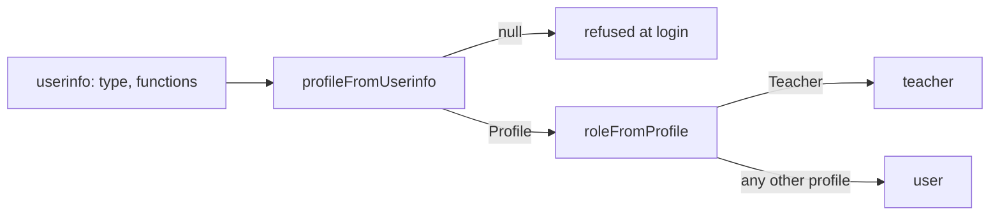

# Integration guidelines

How to add Rukh ENT to an [Edifice](https://edifice.io/) ENT, how it turns an ENT profile into a role, and how to change that mapping safely.

## Integrating with an ENT

### Register the connector

Rukh ENT is an external connector: the ENT only lists it and vouches for the user (see [TEMPLATING.md](TEMPLATING.md#two-kinds-of-ent-modules)). An ENT administrator declares it in the admin console as an [OAuth 2.0 connector](https://edifice-community.atlassian.net/wiki/x/4YCX8):

| Console field | Value |
| --- | --- |
| Client id | Any identifier; it becomes `ENT_CLIENT_ID` |
| Secret | A random secret; it becomes `ENT_CLIENT_SECRET` |
| URL | `https://<your domain>/auth/login`, the page the ENT opens when a user clicks the connector |
| Scope | `userinfo` |
| Mode | `code` (authorization code grant) |

The connector must be attached to the schools and profiles that should see it. A profile the ENT does not expose the connector to never reaches Rukh ENT; a profile it does expose is still filtered by [the role mapping](#how-roles-are-dispatched).

### The OAuth callback

1. `GET /auth/login` sets a `state` cookie and redirects to `ENT_BASE_URL/auth/oauth2/auth`.
2. The ENT redirects back to `ENT_REDIRECT_URI`, which must be `https://<your domain>/auth/callback`, with `code` and `state`.
3. Rukh ENT checks `state`, exchanges the code at `/auth/oauth2/token` (HTTP Basic with the client id and secret), reads `/auth/oauth2/userinfo` once, then discards the ENT access token.
4. It maps the userinfo to a profile and a role, issues the `__Host-rukh` session cookie and redirects to `/`. A refused profile is sent to `/?error=refused`, a bad `state` to `/?error=state`.

The code lives in [`src/ent/ent.controller.ts`](../src/ent/ent.controller.ts) and [`src/ent/ent-oauth.service.ts`](../src/ent/ent-oauth.service.ts).

### `PUBLIC_ORIGIN`

`PUBLIC_ORIGIN` is the scheme and host users see, such as `https://rukh.example`. Every request other than `GET`, `HEAD` and `OPTIONS` must carry it as its `Origin` header ([`origin.middleware.ts`](../src/ent/origin.middleware.ts)), and the MCP authorization server uses it as its issuer. Behind a reverse proxy, set it to the public URL, not the internal one. It must match the host in `ENT_REDIRECT_URI`, since the session cookie is host-only.

### Environment variables

[`src/config/env.validation.ts`](../src/config/env.validation.ts) validates them at startup. It refuses `ENT_MOCK=true` and the development `SESSION_SECRET` when `NODE_ENV=production`. Start from [`.env.example`](../.env.example).

| Variable | Required | Purpose |
| --- | --- | --- |
| `ENT_BASE_URL` | yes | ENT root, such as `https://enthdf.fr` |
| `ENT_CLIENT_ID`, `ENT_CLIENT_SECRET` | yes | From the connector registration |
| `ENT_REDIRECT_URI` | yes | `https://<your domain>/auth/callback` |
| `ENT_USERINFO_VERSION` | no | `userinfo` API version, `2.0` by default |
| `ENT_ALLOWED_MODELS` | no | Comma-separated models teachers may pick |
| `ENT_MOCK` | no | `true` serves a fake ENT at `/mock-ent`; development only |
| `PUBLIC_ORIGIN` | yes | See [above](#public_origin) |
| `SESSION_SECRET` | yes | Signs the session cookie; generate with `openssl rand -base64 48` |
| `SESSION_IDLE_SECONDS`, `SESSION_MAX_SECONDS` | no | 30-minute sliding idle timeout, 8-hour maximum age |
| `MISTRAL_API_KEY`, `ANTHROPIC_API_KEY` | per model | Keys for the providers behind `ENT_ALLOWED_MODELS` |
| `DB_PATH` | no | SQLite file, `data/rukh-ent.db` by default |
| `SWAGGER_ENABLED` | no | Swagger UI at `/api`, unprotected; keep `false` in production |
| `MCP_ENABLED`, `MCP_ROLES`, `MCP_TOKEN_SECONDS` | no | See [MCP](#mcp_roles) |

`ENT_LOG_QUERIES`, `THROTTLE_ASK_LIMIT` and `IMPORT_MAX_BYTES` are validated but not used yet; they are reserved for `/ask` and document import.

### Try it locally

With `ENT_MOCK=true`, `/mock-ent` plays the ENT and offers one login per profile: Teacher, Personnel, Student, Parent (`Relative`), Super-admin and a refused Guest. Use it to check a role change before touching a real ENT.

## How roles are dispatched

Rukh ENT keeps two notions apart, both in [`src/ent/roles.ts`](../src/ent/roles.ts):

- **Profile**: who the user is in the ENT: `Teacher`, `Personnel`, `Student`, `Parent` or `Super-admin`.
- **Role**: what the user may do in Rukh ENT: `teacher` (creates and edits assistants) or `user` (uses them).



### `profileFromUserinfo`

1. If `functions` contains `SUPER_ADMIN`, the profile is `Super-admin`, whatever the type.
2. Otherwise each Edifice `type` is mapped through `PROFILE_BY_TYPE`: `Teacher`, `Personnel`, `Student`, and `Relative` → `Parent`.
3. A user with several types gets the first match in `PRECEDENCE`: `Teacher`, `Personnel`, `Student`, `Parent`. A teacher who is also a parent is a `Teacher`.
4. No match, such as `Guest` or an unknown type, returns `null`, and the callback redirects to `/?error=refused` without issuing a session.

### `roleFromProfile`

`Teacher` → `teacher`; every other profile, `Super-admin` included, → `user`. Super-admins are platform administrators, not course authors, so they get no edit rights by default.

The profile and role are written into the session cookie at login and into each MCP access token at issue. A change to the mapping therefore applies at the user's next login, or within `SESSION_MAX_SECONDS` and `MCP_TOKEN_SECONDS` at most.

## Where a role is enforced

| Where | Rule |
| --- | --- |
| [`EntAuthGuard`](../src/ent/ent-auth.guard.ts), global | Every route needs a session unless marked `@Public()`. It checks identity, not role |
| `AssistantsService.create` ([source](../src/assistants/assistants.service.ts)) | Only `teacher` creates an assistant |
| `canEdit` ([source](../src/assistants/access.ts)) | `teacher` **and** owner (`ownerId` equals the ENT user id) |
| `canSee` ([source](../src/assistants/access.ts)) | Owner, or published to one of the user's schools and to the whole school or one of the user's classes. It ignores the role |
| `mcpRoles` ([source](../src/mcp/mcp-roles.ts)) | Roles listed in `MCP_ROLES` pass the consent screen and `/mcp`; others get 403 |

A `@Roles` decorator and its guard, and the upstream `/web-reader` routes restricted to `teacher`, are planned in the [spec](https://julienberanger.com/ent-module-spec) but not in the code yet. Until then, role checks live in the services listed above.

### `MCP_ROLES`

`MCP_ROLES` is a comma-separated list of roles, `teacher` by default. It is checked twice: on the consent screen before a token is issued, and on every `/mcp` request against the role carried by the token. The ENT session cookie is not accepted on `/mcp`.

## Changing the mapping

Every change below is a code change in `src/ent/roles.ts`, except opening MCP, which is configuration. Update [`roles.spec.ts`](../src/ent/roles.spec.ts) and the end-to-end login tests with it, and check each profile against the mock ENT.

### Map a profile to another role

To give staff edit rights:

```ts
export function roleFromProfile(profile: Profile): Role {
  return profile === 'Teacher' || profile === 'Personnel' ? 'teacher' : 'user';
}
```

**What it exposes:** `Personnel` covers librarians, administrative staff and school life (*vie scolaire*) staff, not only education staff. They could then create assistants, choose models from `ENT_ALLOWED_MODELS` and publish to any class of their schools. Their assistants are visible to students like any teacher's.

### Refuse a profile

To refuse parents, drop `Parent` from `PRECEDENCE` (or `Relative` from `PROFILE_BY_TYPE`): `profileFromUserinfo` returns `null` and the login is refused. A user who is both a parent and a teacher still logs in as `Teacher`.

**What it exposes:** nothing new; it narrows access. Prefer it to hiding the connector in the ENT console, which some ENTs apply per school rather than per profile.

### Accept a new profile

To accept guests, add `Guest` to `Profile`, to `PROFILE_BY_TYPE` and to `PRECEDENCE`, then decide its role in `roleFromProfile`.

**What it exposes:** guests are often external accounts with no school or class, so `canSee` shows them nothing but whole-school assistants of a school they are attached to. Check what the ENT puts in their `uai` before relying on it.

### Change precedence

Reordering `PRECEDENCE` decides which profile wins for a user with several types. Moving `Parent` before `Teacher` would turn every teacher who is also a parent into a `user`, and they would lose edit rights over their own assistants: `canEdit` requires the `teacher` role as well as ownership.

### Add a role

To add, say, a `staff` role that can publish but not choose a model:

1. Add it to `Role` in `src/ent/roles.ts` and to the `role` type in [`web/src/api.ts`](../web/src/api.ts).
2. Return it from `roleFromProfile`.
3. Grep for `role === 'teacher'` and `role !== 'teacher'` and decide, for each check, whether the new role passes.
4. Add it to `MCP_ROLES` if it should reach MCP.

**What it exposes:** today's checks all compare against `teacher`, so the new role is denied everywhere until a check grants it. Keep writing checks that name the roles they allow, never ones that name the roles they refuse, so the next role starts denied too.

### Open MCP to `user`

Set `MCP_ROLES=teacher,user`. No code change.

**What it exposes:** students, many of them minors, could connect a third-party MCP client such as claude.ai or Claude Desktop with their ENT identity. Their prompts and the tools' results then go to a model provider chosen by the student, outside `ENT_ALLOWED_MODELS` and outside any data processing agreement the school signed. This conflicts with the Ministry's rule against asking students to create accounts with AI services (see [RESOURCES.md](RESOURCES.md#why-these-constraints)). Open MCP to `user` only if every `user` profile is an adult, for example after refusing `Student`, or with the school's data protection officer's agreement.
